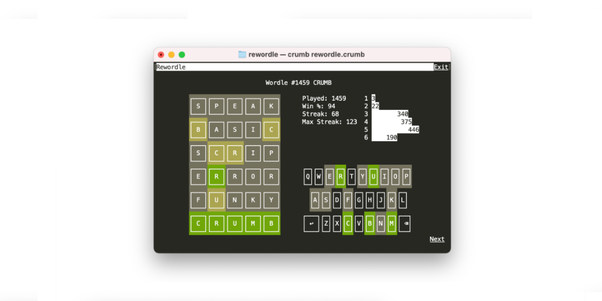

# Rewordle

Rewordle lets you play all the Worlde words from the beginning in the terminal.

It's written in [Crumb](https://github.com/liam-ilan/crumb).

<p align=center></p>

# Install

## Pre Built Binaries

Pre built binaries are provided for each [release](https://github.com/ronilan/crumbicon/releases).

Note: `*-macos-15.tar.gz` is for Apple Silicon, `*-macos-13.tar.gz` is for Intel CPU.

# From Source

Building the app and toolchain from from source can be done locally, or within a Docker container that has a mounted volume to save drawn icons.

### Locally

Clone the repo: 
```
git clone git@github.com:ronilan/rewordle.git
```

CD into directory: 
```
cd rewordle
```

Build Crumb Interpreter and Loaf Bundler: 
```
chmod +x setup.sh && ./setup.sh
```

Run (using interpreter):
```
./crumb rewordle.crumb
```

Build:
```
./loaf rewordle.crumb rewordle
```

Run (as stand alone executable):
```
./rewordle
```

### With Docker:

Build: 
```
docker build -t rewordle.crumb git@github.com:ronilan/rewordle.git#main
```
Run: 
```
docker run --rm -it rewordle.crumb
```

Or "all in one": 
```
docker run --rm -it $(docker build -q git@github.com:ronilan/rewordle.git#main)
```

Then in the shell: 
```
./rewordle
```

# Use

Play it like Wordle!

###### Fabriqué au Canada : Made in Canada 🇨🇦
